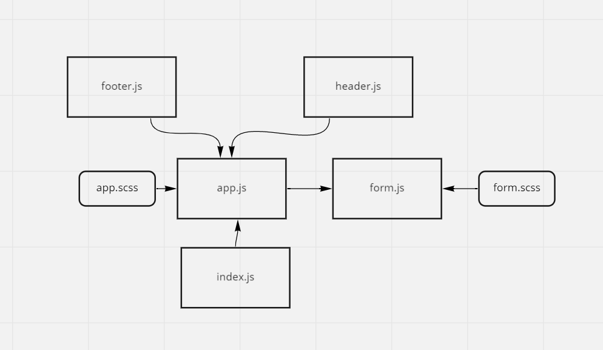

- [pull request base](https://github.com/Saraaltaweel/resty/pull/1)
- [pull request state](https://github.com/Saraaltaweel/resty/pull/2)
- [pull request](https://github.com/Saraaltaweel/resty/pull/3)
- [code sandbox](https://codesandbox.io/s/optimistic-kare-uyzx4)
- [deploy](https://react-restyapp.netlify.app/)
## UML

